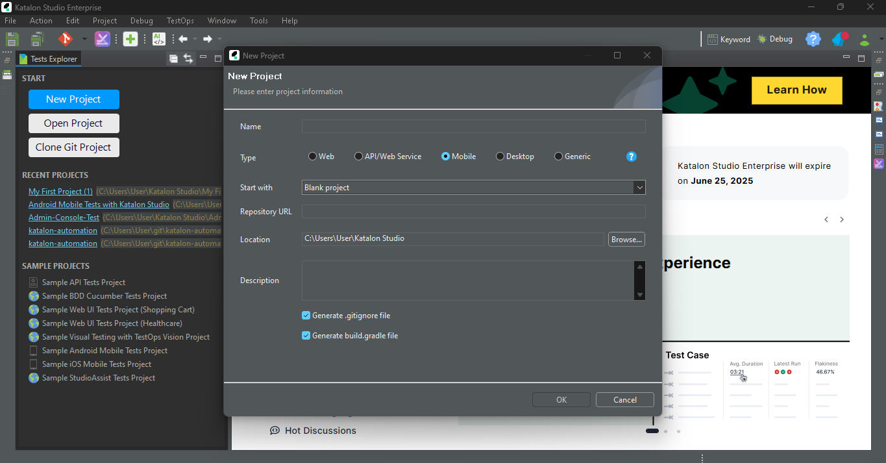

# Dokumentasi Pembuatan Tes Mobile dengan Katalon Studio

Dokumentasi ini menjelaskan langkah-langkah dasar untuk membuat dan menjalankan tes otomatis untuk aplikasi *mobile* menggunakan Katalon Studio.

---

## 1. Prasyarat ⚙️

Sebelum memulai, pastikan Anda telah mempersiapkan hal-hal berikut:

* **Katalon Studio**: Versi terbaru atau versi stabil yang sudah terinstal.
* **Node.js dan Appium**:
    * Instal Node.js (versi LTS direkomendasikan).
    * Instal Appium melalui npm dengan perintah: `npm install -g appium`
    * Instal driver Appium yang sesuai (misalnya, UIAutomator2 untuk Android, XCUITest untuk iOS):
        * `appium driver install uiautomator2`
        * `appium driver install xcuitest`
* **Perangkat Mobile atau Emulator/Simulator**:
    * **Perangkat Fisik**:
        * Aktifkan **Developer Options** dan **USB Debugging** (untuk Android) atau **UI Automation** dan **Enable Web Inspector** (untuk iOS).
        * Pastikan perangkat terhubung dengan benar ke komputer Anda.
    * **Emulator/Simulator**:
        * Android Studio untuk Android Emulator.
        * Xcode untuk iOS Simulator.
* **File Aplikasi (.apk atau .ipa)**: File aplikasi *mobile* yang akan diuji.
* **Koneksi Internet**: Untuk mengunduh *dependencies* jika diperlukan.

---

## 2. Konfigurasi Awal Katalon Studio 🛠️

1.  **Buka Katalon Studio.**
2.  **Buat Proyek Baru**:
    * Klik `File > New > Project`.
    * Masukkan nama proyek dan pilih tipe proyek `Mobile`.
    * Pilih *repository* jika menggunakan sistem kontrol versi (opsional).
    * Klik `OK`.
  

      
3.  **Konfigurasi Appium**:
    * Di Katalon Studio, navigasi ke `Project > Settings > Desired Capabilities > Mobile`.
    * Pilih sistem operasi target (`Android` atau `iOS`).
    * Atur *Desired Capabilities* dasar:
        * **deviceReadyTimeout** (Android): Waktu tunggu (dalam detik) hingga perangkat siap. Contoh: `180`.
        * **app**: Path absolut ke file `.apk` atau `.ipa` Anda. Anda bisa menggunakan tombol `Browse...` untuk memilih file.
        * **appPackage** (Android): Nama paket aplikasi Anda (misalnya, `com.example.app`). Bisa didapatkan dari developer atau menggunakan alat seperti `APK Info`.
        * **appActivity** (Android): Aktivitas utama aplikasi Anda (misalnya, `.MainActivity`). Bisa didapatkan dari developer atau menggunakan alat seperti `APK Info`.
        * **platformName**: `Android` atau `iOS`.
        * **platformVersion**: Versi OS perangkat/emulator (misalnya, `12.0` untuk Android, `15.5` untuk iOS).
        * **deviceName**: Nama perangkat atau ID emulator (misalnya, `emulator-5554` atau nama iPhone Anda). Anda bisa mendapatkan daftar perangkat yang terhubung dengan perintah `adb devices` (untuk Android) atau `xcrun simctl list devices` (untuk iOS Simulator) dan `idevice_id -l` (untuk perangkat iOS fisik setelah menginstal `libimobiledevice`).
        * **udid** (iOS, untuk perangkat fisik): Unique Device Identifier.
        * **automationName**: `UiAutomator2` (untuk Android), `XCUITest` (untuk iOS).
    * Klik `Apply and Close`.
4.  **Konfigurasi Appium Directory**:
    * Navigasi ke `Window > Katalon Studio Preferences > Katalon > Mobile`.
    * Pastikan *Appium Directory* mengarah ke lokasi instalasi Appium Anda (biasanya terdeteksi otomatis jika Appium diinstal secara global).

---

## 3. Membuat Test Case 🧪

Ada dua cara utama untuk membuat *test case* di Katalon Studio: *Record Mobile* dan *Manual Scripting*.

### 3.1. Menggunakan Record Mobile ⏺️

Fitur ini memungkinkan Anda merekam interaksi dengan aplikasi dan secara otomatis menghasilkan langkah-langkah tes.

1.  **Buka Perspektif Mobile**: Jika belum, klik ikon *Mobile* di *toolbar* atau navigasi ke `Window > Perspective > Mobile`.
2.  **Klik Tombol 'Record Mobile'**: Tombol ini biasanya bergambar ikon ponsel dengan titik merah.
3.  **Konfigurasi Perekaman**:
    * **Application File**: Pilih file `.apk` atau `.ipa` aplikasi Anda.
    * **Device Name**: Pilih perangkat/emulator yang terhubung dari daftar *dropdown*. Jika perangkat tidak muncul, pastikan sudah terkonfigurasi dengan benar dan terdeteksi oleh Appium.
    * Klik `Start`. Katalon akan menginstal aplikasi (jika belum terinstal) dan meluncurkannya di perangkat/emulator.
4.  **Mulai Merekam**:
    * Jendela **Mobile Recorder** akan muncul, menampilkan layar aplikasi.
    * Interaksikan dengan aplikasi seperti yang dilakukan pengguna (klik tombol, isi *field*, geser layar, dll.).
    * Setiap tindakan akan direkam dan ditampilkan di panel **Recorded Actions**.
    * Anda dapat menambahkan validasi (misalnya, verifikasi teks, keberadaan elemen) menggunakan tombol yang tersedia di *toolbar Mobile Recorder*.
5.  **Simpan Objek dan Test Case**:
    * Setelah selesai merekam, klik tombol `Save script`.
    * Katalon akan meminta Anda untuk menyimpan objek yang terekam ke dalam **Object Repository**. Atur struktur folder sesuai kebutuhan.
    * Beri nama *Test Case* Anda dan simpan.

### 3.2. Membuat Script Secara Manual ✍️

Anda juga bisa menulis skrip tes secara manual menggunakan Groovy (bahasa yang digunakan Katalon Studio) dan *built-in keywords* Katalon.

1.  **Buat Test Case Baru**:
    * Di panel **Tests Explorer**, klik kanan pada folder `Test Cases`.
    * Pilih `New > Test Case`.
    * Beri nama *Test Case* dan klik `OK`.
2.  **Tulis Script**:
    * *Test Case* akan terbuka dalam tampilan *Manual* atau *Script*. Anda bisa beralih antar tampilan.
    * Dalam tampilan *Script*, Anda bisa menulis kode seperti contoh berikut:

    ```groovy
    import com.kms.katalon.core.mobile.keyword.MobileBuiltInKeywords as Mobile
    import com.kms.katalon.core.model.FailureHandling

    // Memulai aplikasi
    Mobile.startApplication('path/to/your/app.apk', true) // Ganti dengan path aplikasi Anda atau biarkan kosong jika sudah diatur di Desired Capabilities

    // Menunggu elemen tombol login muncul (contoh)
    Mobile.waitForElementPresent(findTestObject('Object Repository/Page_Login/btnLogin'), 30)

    // Klik tombol login
    Mobile.tap(findTestObject('Object Repository/Page_Login/btnLogin'), 10)

    // Masukkan username
    Mobile.setText(findTestObject('Object Repository/Page_Login/txtUsername'), 'namaPenggunaAnda', 10)

    // Masukkan password
    Mobile.setEncryptedText(findTestObject('Object Repository/Page_Login/txtPassword'), 'kunciPasswordTerenkripsiAnda', 10) // Gunakan setEncryptedText untuk password

    // Klik tombol submit
    Mobile.tap(findTestObject('Object Repository/Page_Login/btnSubmit'), 10)

    // Tambahkan verifikasi (contoh: verifikasi teks selamat datang)
    Mobile.verifyElementText(findTestObject('Object Repository/Page_Dashboard/lblWelcome'), 'Selamat Datang!', FailureHandling.STOP_ON_FAILURE)

    // Menutup aplikasi
    Mobile.closeApplication()
    ```
    * Gunakan **Object Repository** untuk menyimpan dan mengelola elemen UI aplikasi Anda.

---

## 4. Mengelola Objek (Object Repository) 🎯

*Object Repository* adalah tempat Anda menyimpan semua elemen UI (*buttons, text fields, labels*, dll.) yang akan diinteraksikan oleh skrip tes Anda.

### 4.1. Menambahkan Objek Secara Manual

1.  Di panel **Tests Explorer**, klik kanan pada folder `Object Repository`.
2.  Pilih `New > Mobile Object`.
3.  Beri nama objek (misalnya, `btnLogin`, `txtUsername`).
4.  Di jendela **Test Object**, Anda perlu mendefinisikan *locator* untuk objek tersebut.
    * **Object Properties**: Tambahkan properti untuk mengidentifikasi elemen secara unik.
        * **Locator Strategy**: Pilih strategi pencarian (misalnya, `Accessibility Id`, `xpath`, `id`, `name`, `class name`).
        * **Locator**: Masukkan nilai *locator*.
    * Anda bisa menggunakan **Mobile Spy** untuk membantu mengidentifikasi *locator*.

### 4.2. Menggunakan Mobile Spy 🕵️

*Mobile Spy* membantu Anda menangkap objek dari aplikasi yang sedang berjalan dan menyimpannya ke *Object Repository*.

1.  Klik tombol **'Spy Mobile'** di *toolbar*.
2.  Konfigurasi serupa dengan **Record Mobile** (pilih aplikasi dan perangkat).
3.  Klik `Start`. Aplikasi akan diluncurkan.
4.  Jendela **Mobile Object Spy** akan muncul.
    * Di panel kiri atas, Anda akan melihat hierarki elemen UI.
    * Klik pada elemen di layar perangkat (yang direfleksikan di *Mobile Object Spy*) atau pada hierarki untuk melihat detail propertinya.
    * Pilih *locator* yang paling andal.
    * Centang objek yang ingin Anda simpan, lalu klik tombol `Add to Object Repository`.
    * Atur struktur folder di *Object Repository* dan simpan.

---

## 5. Menjalankan Test Case ▶️

1.  **Pilih Test Case**: Buka *Test Case* yang ingin Anda jalankan.
2.  **Pilih Perangkat**: Di *toolbar* eksekusi, klik *dropdown* di sebelah tombol `Run`.
3.  Pilih `Mobile` dan kemudian pilih perangkat/emulator yang terdaftar (misalnya, `Android` atau `iOS`). Pastikan Appium server sudah berjalan (Katalon Studio biasanya akan menanyakannya atau Anda bisa menjalankannya secara manual).
4.  **Lihat Eksekusi**: Katalon akan menjalankan langkah-langkah tes pada perangkat/emulator yang dipilih. Anda bisa melihat progresnya di *Log Viewer*.

---

## 6. Melihat Hasil Tes dan Laporan 📊

Setelah eksekusi selesai, Katalon Studio secara otomatis menghasilkan laporan.

1.  **Akses Laporan**:
    * Laporan dapat ditemukan di folder `Reports` di *Tests Explorer*. Laporan diatur berdasarkan tanggal dan waktu eksekusi.
    * Anda juga bisa melihat ringkasan hasil di *Test Suite* atau *Test Suite Collection* jika menjalankannya dalam grup.
2.  **Detail Laporan**:
    * Laporan mencakup ringkasan eksekusi (*Pass/Fail/Error*), detail langkah-langkah, *screenshot* (jika ada kegagalan), dan *log*.
    * Anda dapat mengekspor laporan ke berbagai format seperti HTML, PDF, CSV, dan JUnit.

---

## 7. Tips Tambahan ✨

* **Gunakan Data-Driven Testing**: Untuk menguji dengan berbagai set data, manfaatkan fitur *Data-Driven Testing* Katalon.
* **Buat Custom Keywords**: Untuk fungsionalitas yang sering digunakan, buat *Custom Keywords* agar skrip lebih modular dan mudah dipelihara.
* **Integrasi CI/CD**: Katalon Studio mendukung integrasi dengan alat CI/CD seperti Jenkins, Bamboo, dll., untuk otomatisasi penuh.
* **Kelola Waktu Tunggu (Wait)**: Gunakan *keywords* `waitForElementPresent`, `waitForElementVisible`, dll., untuk menangani isu sinkronisasi dan memastikan elemen sudah siap sebelum diinteraksikan.
* **Gunakan FailureHandling**: Tentukan bagaimana tes harus berperilaku saat terjadi kegagalan (`STOP_ON_FAILURE`, `CONTINUE_ON_FAILURE`, `OPTIONAL`).

---

Selamat mencoba membuat tes *mobile* dengan Katalon Studio!
